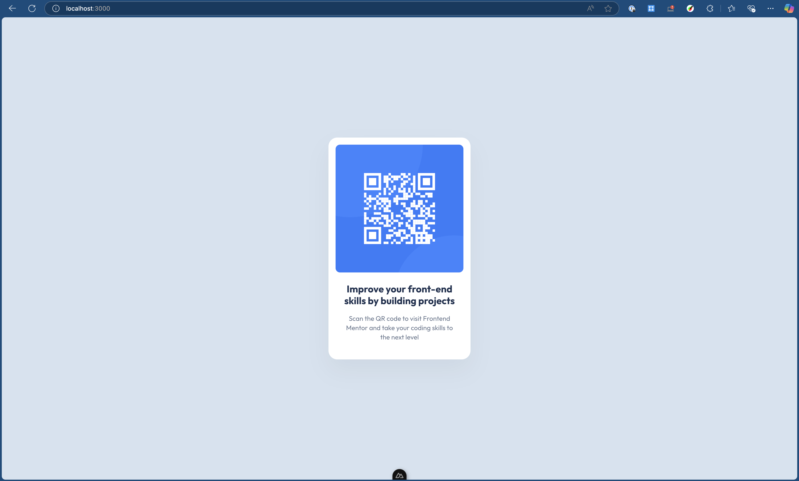

# Frontend Mentor - QR code component solution

This is a solution to the [QR code component challenge on Frontend Mentor](https://www.frontendmentor.io/challenges/qr-code-component-iux_sIO_H). Frontend Mentor challenges help you improve your coding skills by building realistic projects. 

## Table of contents

- [Overview](#overview)
  - [Screenshot](#screenshot)
  - [Links](#links)
- [My process](#my-process)
  - [Built with](#built-with)
  - [What I learned](#what-i-learned)
- [Author](#author)

**Note: Delete this note and update the table of contents based on what sections you keep.**

## Overview

### Screenshot

### Links

- Solution URL: [Add solution URL here](https://your-solution-url.com)
- Live Site URL: [Add live site URL here](https://your-live-site-url.com)

## My process
- Setup the project with Nuxt script
- Include ESLint, NuxtUI, Nuxt Fonts, TailwindCSS v4
- Setup theme using Figma design file

### Built with

- Flexbox
- CSS Grid
- Mobile-first workflow
- [Vue](https://reactjs.org/) - JS library
- [Nuxt](https://nextjs.org/) - Vue framework
- [TailwindCSS](https://styled-components.com/) - For styles

### What I learned

I learned how to use TailwindCSS v4 and find that it is very comfortable to use.

## Author

- Frontend Mentor - [@yourusername](https://www.frontendmentor.io/profile/son-nguyen-301)
